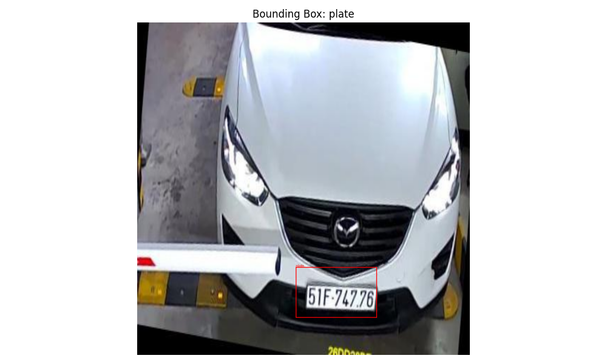
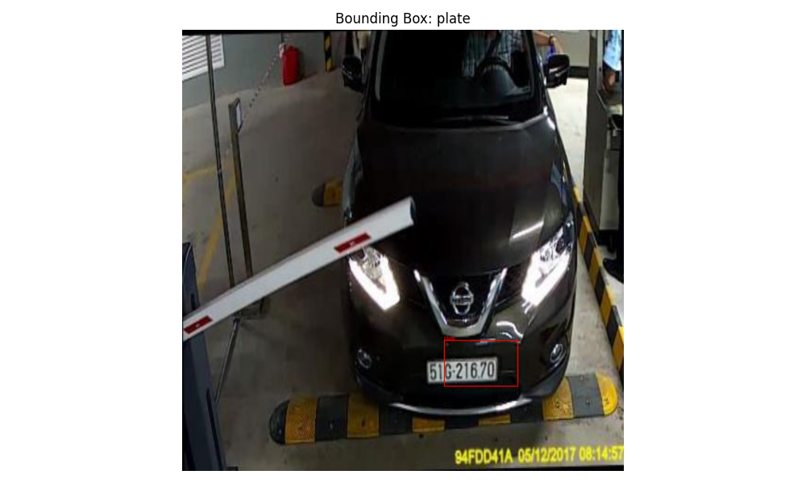

# Fine-tuning Gemma 3 for Object Detection

| [🧠 Model Space](https://huggingface.co/spaces/ariG23498/gemma3-license-plate-detection) | [📦 Release Collection](https://huggingface.co/collections/ariG23498/gemma-3-object-detection-682469cb72084d8ab22460b3) |

This repository demonstrates how to adapt **Gemma 3**, a powerful vision-language model (VLM), for **object detection**. By treating bounding boxes as discrete `<locXXXX>` tokens, we enable the model to reason about spatial information in a language-native way — inspired by [PaliGemma](https://huggingface.co/papers/2412.03555).


## 🔍 Model Predictions

Here's a glimpse of what our fine-tuned model can do. These images are generated by the `predict.py` script:

| Detected License Plates            | Detected License Plates            |
| :--------------------------------: | :--------------------------------: |
|           |           |
|           |           |


## 🧠 Vision-Language Object Detection with Location Tokens

Most traditional object detection models output continuous bounding box coordinates using regression heads. In contrast, we follow the [PaliGemma](https://huggingface.co/blog/paligemma2mix) approach of treating bounding boxes as **sequences of discrete tokens** (e.g., `<loc0512>`), allowing detection to be framed as **text generation**.

However, unlike PaliGemma, **Gemma 3 does not natively include these spatial tokens** in its tokenizer.

We support two fine-tuning modes:

### 1. Without Extending the Tokenizer

The model is trained with `<locXXXX>` tokens even though they are not in the tokenizer vocabulary. This forces it to learn spatial grounding implicitly. Although lightweight, it presents interesting results.

### 2. With Extended Tokenizer

By using the flag `--include_loc_tokens`, we extend the tokenizer to explicitly include all `<locXXXX>` tokens (from `<loc0000>` to `<loc1023>`) and fine-tune the embeddings for them. After this, we fine-tune the entire model, following a two-stage training procedure. This enables the model to learn spatial grounding more effectively. Learn more [here](https://github.com/ariG23498/gemma3-object-detection/issues/19#issuecomment-2912310198).

> 💡 Both modes are supported — toggle with `--include_loc_tokens` in `train.py`.

<p align="center">
  
</p>


## 📁 Dataset

We use the [`ariG23498/license-detection-paligemma`](https://huggingface.co/datasets/ariG23498/license-detection-paligemma) dataset, a modified version of `keremberke/license-plate-object-detection`, reformatted to match the expectations of text-based object detection.

Each bounding box is encoded as a sequence of location tokens like `<loc0123>`, following the PaliGemma format.

To reproduce the dataset or modify it for your use case, refer to the script [`create_dataset.py`](./create_dataset.py).


## ⚙️ Setup and Installation

Get your environment ready to fine-tune Gemma 3:

```bash
git clone https://github.com/ariG23498/gemma3-object-detection.git
uv venv .venv --python 3.10
source .venv/bin/activate
uv pip install -r requirements.txt
```

## 🔧 Usage

Follow these steps to configure, train, and run predictions:

Configure your training via `config.py`. All major parameters — like learning rate, model path, and dataset — are defined here.

1. Train the model using:

```bash
python train.py --include_loc_tokens
```

Toggle `--include_loc_tokens` based on your strategy (see explanation above).

Run inference with:

```bash
python predict.py
```

This script uses the fine-tuned model to detect license plates and generates images in the outputs/ folder.


## 🗺️ Roadmap

Here are some tasks that we would want to investigate further.

1. Low Rank Adaptation Training.
2. Quantized Low Rank Adaptation Training.
3. Train with a bigger object detection dataset.


## 🤝 Contributions

We welcome contributions to enhance this project! If you have ideas for improvements, bug fixes, or new features, please:

1. Fork the repository.
2. Create a new branch for your feature or fix:
```bash
git checkout -b feature/my-new-feature
```
3. Implement your changes.
4. Commit your changes with clear messages:
```bash
git commit -am 'Add some amazing feature'
```
5. Push your branch to your fork:
```bash
git push origin feature/my-new-feature
```
6. Open a Pull Request against the main repository.

## 📜 Citation

If you use our work, please cite us.
```
@misc{gosthipaty_gemma3_object_detection_2025,
  author = {Aritra Roy Gosthipaty and Sergio Paniego},
  title = {Fine-tuning Gemma 3 for Object Detection},
  year = {2025},
  publisher = {GitHub},
  journal = {GitHub repository},
  howpublished = {\url{https://github.com/ariG23498/gemma3-object-detection.git}}
}
```

## 📚 References

- [Gemma 3 blog](https://huggingface.co/blog/gemma3)
- [Gemma 3 paper](https://huggingface.co/papers/2503.19786)
- [PaliGemma 2 Paper](https://huggingface.co/papers/2412.03555)
- [PaliGemma 2 Mix – Hugging Face Blog](https://huggingface.co/blog/paligemma2mix)
