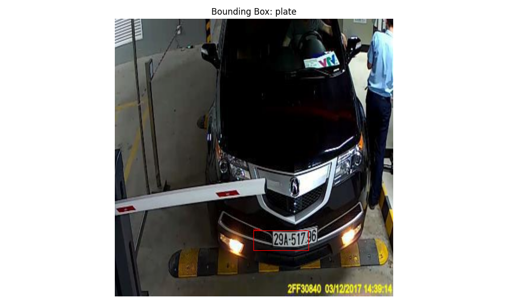

# Fine-tuning Gemma 3 for Object Detection

Here's a glimpse of what our fine-tuned Gemma 3 model can achieve in detecting license plates. These images are generated by the `predict.py` script:

| Detected License Plates (Sample 1) | Detected License Plates (Sample 2) |
| :--------------------------------: | :--------------------------------: |
|           |           |
|           |           |

This repository focuses on adapting vision and language understanding of Gemma 3 for object detection. We achieve this by fine-tuning the model on a specially prepared dataset.

## Dataset:

For fine-tuning, we use the [`ariG23498/license-detection-paligemma`](https://huggingface.co/datasets/ariG23498/license-detection-paligemma) dataset. This dataset is a modified version of `keremberke/license-plate-object-detection`, preprocessed to align with the input format expected by models that use location tokens for bounding boxes (similar to PaliGemma). Refer to `create-dataset.py` for details on the process.

### Why Special `<locXXXX>` Tags?

The use of discrete location tokens (e.g., <loc0000>, <loc0512>, <loc1023>) is a technique popularized by PaliGemma for representing spatial information within a text-based framework.

It allows the language model to treat object locations as part of its existing vocabulary. Instead of outputting continuous numerical coordinates (which would typically require a separate regression head), the model predicts a sequence of these location tokens, similar to how it generates text.

## Setup and Installation

Get your environment ready to fine-tune Gemma 3:

```bash
git clone https://github.com/ariG23498/gemma3-object-detection.git
uv venv .venv --python 3.10
source .venv/bin/activate
uv pip install -r requirements.txt
```

## Usage

Follow these steps to configure, train, and run predictions:

1. Configuration (`config.py`): All major parameters are centralized here. Before running any script, review and adjust these settings as needed.
2. Training (`train.py`): This script handles the fine-tuning process.
3. Running inference (`infer.py`): Run this to visualize object detection.

## Roadmap

Here are some tasks that we would want to investigate further.

1. Low Rank Adaptation Training.
2. Quantized Low Rank Adaptation Training.
3. Extend the tokenizer of Gemma 3 with the `<locxxxx>` tags.
4. Train with a bigger object detection dataset .


## Contributions

We welcome contributions to enhance this project! If you have ideas for improvements, bug fixes, or new features, please:

1. Fork the repository.
2. Create a new branch for your feature or fix:
```bash
git checkout -b feature/my-new-feature
```
3. Implement your changes.
4. Commit your changes with clear messages:
```bash
git commit -am 'Add some amazing feature'
```
5. Push your branch to your fork:
```bash
git push origin feature/my-new-feature
```
6. Open a Pull Request against the main repository.

## Citation Information

If you use our work, please cite us.
```
@misc{gosthipaty_gemma3_object_detection_2025,
  author = {Aritra Roy Gosthipaty and Sergio Paniego},
  title = {Fine-tuning Gemma 3 for Object Detection},
  year = {2025},
  publisher = {GitHub},
  journal = {GitHub repository},
  howpublished = {\url{https://github.com/ariG23498/gemma3-object-detection.git}}
}
```
